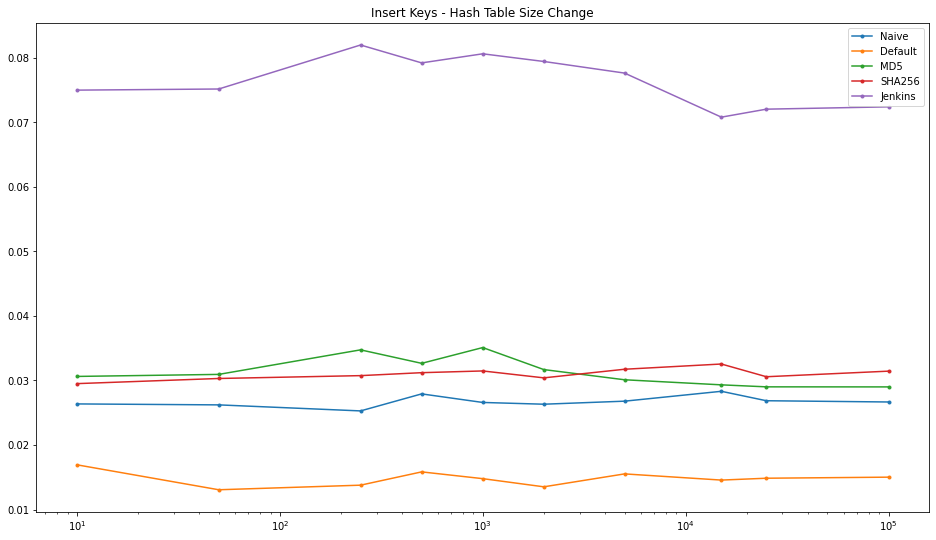
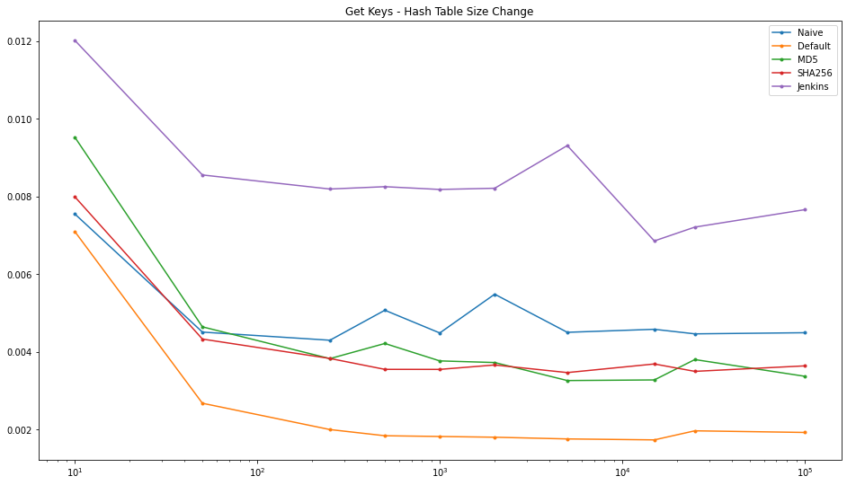
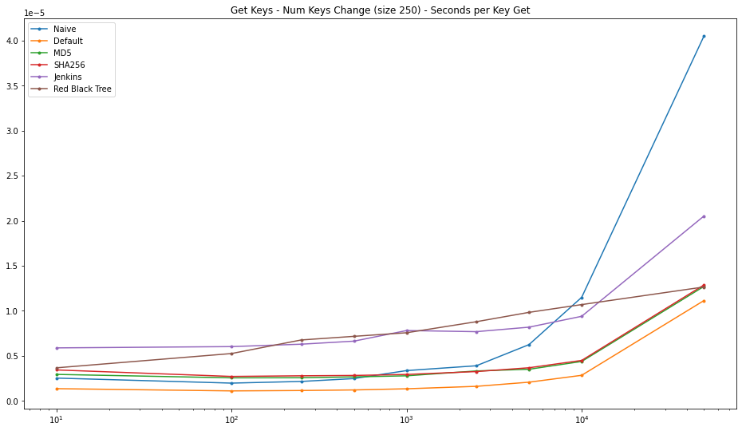

# Dictionaries Implementation

Dictionaries implementation with different data structures (red-black trees and hash tables) from scratch.

[Read presentation](./Assets/Algorithms_Dictionary_Implementations.pdf)

---

## Analysis

[Analysis Notebook](./analysis.ipynb)

The analyses were conducted from two perspectives: 
 1 Performance evaluation with respect to the size of the hash tables
 2 Performance evaluation on *Insert* and *Get* operations
 
The hash tables used for the analysis are distinguished withrespect to their hash functions:  
 - **Naive**: computes the hash by summing the unicodecode point for each char in the input string;
 - **Default**: uses the built-in hash functions from Python;
 - **MD5**: widely used hash function, mainly forcryptographic purposes even though it is now ”broken”;
 - **SHA256**: cryptographic hash function used in someof the most popular authentication and encryptionprotocols without any known collision ever found.However, it takes a very long time to compute the hash;
 - **Jenkins**: Jenkins hash and its variants require morecomputation, but they give a better distribution and thuswill generally make for fewer collisions and a smallerrequired table size
 
For the binary search tree, an implementation of **Red Black Tree** has been used and adapted to be employed as a dictionary.

### Size of the Hash Table

The size of the hash table is one of the tuning parameters, to be taken into account for performance analysis.  Indeed, the size of the hash table has a direct impact on the number of hash collisions that will occur during the use of the dictionary. There is no correct hash table size, but it tends to be adjusted based on the number of items we want to keep in the hash table. 

I tested the *Insert* and *Get* operations, respectively for 10,000 and 1,000 keys.

### Number of Keys

The number of keys inserted and retrieved is the factor that actually determines the execution time.  By varying the number of keys used, we can verify the differences between Hash Tables and Red Black Trees, and determine which hash function is more performant. 

For the analysis I kept the size of the hash tables constant at 250, while the number of keys varies from 10 to 50,000.

## Findings

 - The tests performed reflect the theoretical expectations in terms of time complexity;
 - In order to maintain a desired degree in performance, it is necessary to adapt the implementation to the problem at hand;
 - In the case of hash tables, the choice of hash function is one of the most important factors;
 - To improve the performance of hash tables we could implement a dynamic table size based on the number of keys to be handled;

---

## Further Work

 - Implement **Open Address** and analyze performance;
 - Introduce and estimate for **cache efficiency**;
 - Use a **Nested Hash Table** to deal with collisions instead of a Python list;
 
---

